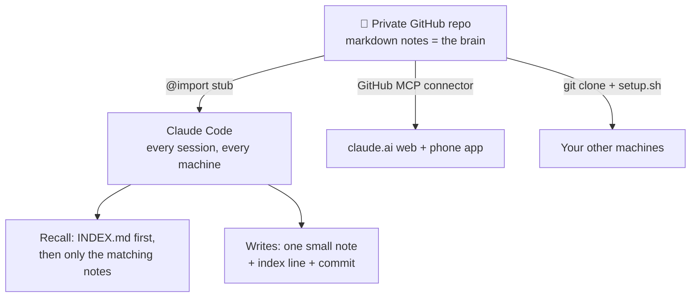

# 🧠 claude-brain-kit

**Your Claude, the same collaborator on every device — powered by nothing but a git
repo.**

Claude forgets you every session. This kit fixes that with the simplest thing that
works: a private GitHub repo of markdown notes that *is* Claude's long-term memory —
who you are, how you like to work, what you're building together, and the history of
it all. No database, no daemon, no server, no subscription. Files, git, and a
protocol.

Set it up in ~10 minutes. The first Claude session **interviews you** and writes its
own brain.

## What you get

- 🪪 **A person-level brain** — identity, preferences, conventions, projects, and a
  shared journal that follow you across every machine and project. (Claude's native
  auto-memory is per-project and per-machine; this is the layer above it.)
- 📱 **Every Claude surface** — Claude Code on your machines, plus claude.ai in the
  browser and the phone app via the GitHub MCP connector: your phone chat can recall
  your notes and commit new memories.
- 🔐 **A real secrets policy** — the brain stores *pointers* to credentials, never
  values, enforced three ways (gitignore, optional pre-commit hook, gitleaks CI).
- 🧾 **Zero infrastructure** — recall is an index file and small notes, not a vector
  database. Everything is human-readable markdown with git history. If you stop
  using it tomorrow, you keep a perfectly readable archive of your work and life.

## Quickstart

1. **[Use this template](../../generate)** → create your copy — set visibility to
   **🔒 Private**. (Your brain will contain your life. Private. Really.)
2. **Clone it:**
   ```bash
   git clone git@github.com:<you>/<your-brain-repo>.git ~/claude-brain
   ```
3. **Run setup:**
   ```bash
   bash ~/claude-brain/setup.sh
   ```
   Personalizes the templates, wires the brain into `~/.claude/CLAUDE.md` (via a
   one-line `@import` stub — or `--symlink` if you prefer), raises Claude Code's
   transcript retention, and offers a gitleaks pre-commit hook.
4. **Start any Claude Code session.** Claude notices the brain is new and offers to
   interview you — five minutes of questions, then it writes your identity notes,
   commits, and deletes its own setup instructions. You're live.
5. **Just work.** When something durable comes up, Claude writes it down (or you say
   *"remember this"*). Memories are commits; `git push` syncs them everywhere.

**Verify it worked:** open a fresh session and ask *"what do you know about me?"*

## How it works



The bootloader (`CLAUDE.md`) loads into every session and teaches Claude two
protocols. **Recall:** skim `INDEX.md` (one line per note), open only what matches
the task — so a growing brain never bloats your context. **Write:** when something
durable is learned, save one small note, index it, commit it. Curated memory, not
auto-captured noise — every note is one a human or Claude *decided* was worth
keeping, and you can read all of them.

```
identity/      who you are & how you like to work   (loads when relevant)
projects/      one mission-control note per project
knowledge/     hard-won gotchas & durable facts
conventions/   standing rules for how Claude works with you
pointers/      where external things live (incl. the secrets policy)
journal/       dated log of the sessions that mattered
INDEX.md       the catalog recall runs on
CLAUDE.md      the bootloader (protocols + who you are)
```

Deep dive: [docs/how-it-works.md](docs/how-it-works.md)

## Go further

| Guide | What it unlocks |
|---|---|
| [claude.ai + mobile](docs/claude-ai-and-mobile.md) | The same brain in browser chats and the phone app — read *and write* — via the GitHub MCP connector (and the read-only-integration trap to avoid) |
| [More surfaces](docs/more-surfaces.md) | Second machine in two commands; Claude Code web; cloud sessions |
| [Maintenance](docs/maintenance.md) | The habits + a monthly consolidation prompt that keep the brain trustworthy |
| [Security](docs/security.md) | Why private, the pointers-not-secrets policy, and the three enforcement layers |

## FAQ

**Is my data private?** The brain lives in *your* private repo under *your* account.
This template contains no telemetry, no service, no third party — the only parties
are you, GitHub, and whatever Claude surfaces you connect.

**How is this different from Claude's built-in memory?** Complementary, not
competing. Claude Code's auto-memory is scoped to one project on one machine, and
claude.ai's memory is opaque and unportable. The brain is the *person-level* layer:
one identity, every project, every machine, every surface — in files you own, can
read, and can take with you. Keep auto-memory on; it handles project minutiae while
the brain holds you.

**What does it cost?** $0. Free GitHub private repo, free CI scan, no services.

**Windows?** Use the default `@import` stub (no symlink, no Developer Mode needed)
and run `setup.sh` under Git Bash or WSL — or do the two setup steps by hand: put
`@C:/path/to/your-brain/CLAUDE.md` in `~/.claude/CLAUDE.md` and you're wired.

**Does my brain repo run these GitHub Actions?** Just one: a gitleaks scan on every
push, as a secrets backstop. Delete `.github/workflows/gitleaks.yml` if you don't
want it (not recommended).

**A friend shared this with me — where do I start?** Right at [Quickstart](#quickstart).
The whole point is that step 4 explains the system *to you, in conversation*.

## Philosophy, in three lines

- The repo **is** the brain — files and git, no moving parts to operate or trust.
- Curation over capture — memory is what's worth keeping, not everything that happened.
- A brain leak must never be a credential leak — pointers, not secrets.

---

MIT licensed. Built from a system that's been running daily since mid-2026; issues
and PRs welcome — especially "this step didn't match what I saw" doc fixes.
