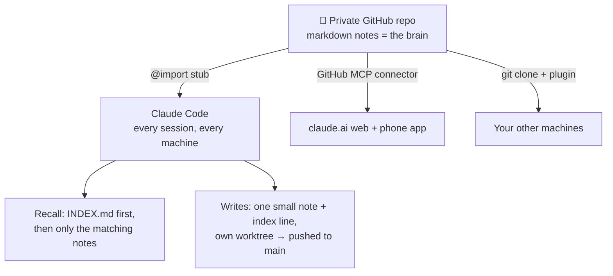

# 🧠 claude-brain-kit

**Your Claude, the same collaborator on every device — powered by nothing but a git
repo.**

Claude forgets you every session. This kit fixes that with the simplest thing that
works: a private GitHub repo of markdown notes that *is* Claude's long-term memory —
who you are, how you like to work, what you're building together, and the history of
it all. No database, no daemon, no server, no subscription. Files, git, one client
plugin, and a protocol.

Set it up in ~10 minutes. The first Claude session **interviews you** and writes its
own brain.

## What you get

- 🪪 **A person-level brain** — identity, preferences, conventions, projects, and a
  shared journal that follow you across every machine and project. (Claude's native
  auto-memory is per-project and per-machine; this is the layer above it.)
- 📱 **Every Claude surface** — Claude Code on your machines, plus claude.ai in the
  browser and the phone app via the GitHub MCP connector: your phone chat can recall
  your notes and commit new memories.
- 🎙️ **Voice mode too** — an optional tiny MCP server of your own (`tools/brain-remote/`,
  deployed free on Cloudflare Workers in one command) gives voice chats full recall
  and protocol-true writes: atomic note+index commits with guardrails, from any
  connector surface.
- 🗓️ **A to-do list, idea inbox, and living profile — with zero infrastructure** —
  AI-mediated mechanisms that ride your conversations instead of a scheduler: a
  once-a-day digest of due chores ("remind me to X" files an item from any surface),
  zero-friction idea capture ("idea: …" → filed in one line), and an evidence-based
  profile that grows as you work — with a veto announcement on every capture.
- 🔌 **A Claude Code plugin** — session-start auto-sync, concurrency-safe writes,
  `/brain:todos` & `/brain:idea`, versioned with `claude plugin update`.
- 🔐 **A real secrets policy** — the brain stores *pointers* to credentials, never
  values, enforced three ways (gitignore, optional pre-commit hook, gitleaks CI) —
  including custom rules for the markdown-shaped leaks stock scanners miss.
- 🧾 **Zero infrastructure** — recall is an index file and small notes, not a vector
  database. Everything is human-readable markdown with git history. If you stop
  using it tomorrow, you keep a perfectly readable archive of your work and life.

## Quickstart

1. **[Use this template](../../generate)** → create your copy — set visibility to
   **🔒 Private**. (Your brain will contain your life. Private. Really.)
2. **Clone it:**
   ```bash
   git clone git@github.com:<you>/<your-brain-repo>.git ~/claude-brain
   ```
3. **Install the plugin:**
   ```bash
   claude plugin marketplace add generalOtto/claude-brain-kit && claude plugin install brain@claude-brain-kit
   ```
   It brings the session-start hook that auto-pulls the brain and tells Claude
   whether the clone is fresh, `brain-write.sh` on PATH, and the brain skills.
   If your clone is not at `~/claude-brain`, add `--config brain_dir=<path>` to the
   install command (or set it later under `/plugin` → brain → configure).
4. **Wire this machine:** start a Claude Code session and run `/brain:setup` —
   it personalizes the templates, wires the brain into `~/.claude/CLAUDE.md` (a
   one-line `@import` stub), raises Claude Code's transcript retention, and offers
   a gitleaks pre-commit hook. On a new brain, Claude offers to interview you in
   your next session — five minutes of questions, then it writes your identity
   notes, commits, and deletes its own setup instructions. You're live.
5. **Just work.** When something durable comes up, Claude writes it down (or you say
   *"remember this"*). Memories are commits, pushed the moment they're made —
   claude.ai and your phone see them live, other machines at their next pull.

**Verify it worked:** open a fresh session and ask *"what do you know about me?"*

## How it works



The bootloader (`CLAUDE.md`) loads into every session and teaches Claude two
protocols. **Recall:** skim `INDEX.md` (one line per note), open only what matches
the task — so a growing brain never bloats your context. **Write:** when something
durable is learned, save one small note, index it, and publish it — each write lands
in its own git worktree and is pushed to `main` immediately, so parallel sessions
never clobber each other and nothing sits unpushed. Curated memory, not
auto-captured noise — every note is one a human or Claude *decided* was worth
keeping, and you can read all of them.

```
identity/      who you are & how you like to work   (loads when relevant)
projects/      one mission-control note per project
knowledge/     hard-won gotchas & durable facts
conventions/   standing rules for how Claude works with you
ideas/         idea seeds, filed by category the moment you say "idea: …"
pointers/      where external things live (incl. the secrets policy)
journal/       dated log of the sessions that mattered
plugins/       brain/ (the Claude Code plugin: sync hook, brain-write.sh, skills)
               · brain-remote/ (registers your brain MCP server for clone-less sessions, if needed)
tools/         brain-remote/ (the optional remote MCP server — voice mode + connector writes)
tests/         the plugin's test suite
TODO.md        the single to-do list — surfaced as a daily digest, opened with "todos"
INDEX.md       the catalog recall runs on
CLAUDE.md      the bootloader (protocols + who you are)
```

Deep dive: [docs/how-it-works.md](docs/how-it-works.md)

## Go further

| Guide | What it unlocks |
|---|---|
| [claude.ai + mobile](docs/claude-ai-and-mobile.md) | The same brain in browser chats and the phone app — read *and write* — via the GitHub MCP connector (plus the two traps: the read-only integration, and the authorized-but-not-installed 404) |
| [Voice mode](docs/voice.md) | Your own free MCP server (one command, Cloudflare Workers) — full recall in voice mode, which the GitHub connector can't do, plus atomic guarded writes from every connector surface |
| [One-sentence onboarding](docs/bootstrap.md) | Add any new device by saying one sentence — Claude reads the setup instructions *from the brain itself* and self-onboards (connector-only "satellite" tier, or full clone via a repo-scoped deploy key) |
| [More surfaces](docs/more-surfaces.md) | Second machine; Claude Code web; cloud sessions |
| [Maintenance](docs/maintenance.md) | The habits + a monthly consolidation prompt that keep the brain trustworthy |
| [Security](docs/security.md) | Why private, the pointers-not-secrets policy, and the three enforcement layers |
| [Zero-friction operations](docs/zero-friction.md) | Fetch secrets instead of asking for them, keep the `claude` login alive, and the other standing decisions that keep Claude from needing you for things it can just do |

## FAQ

**Is my data private?** The brain lives in *your* private repo under *your* account.
This template contains no telemetry, no service, no third party — the only parties
are you, GitHub, and whatever Claude surfaces you connect (plus Cloudflare, only if
you opt into the voice server).

**How is this different from Claude's built-in memory?** Complementary, not
competing. Claude Code's auto-memory is scoped to one project on one machine, and
claude.ai's memory is opaque and unportable. The brain is the *person-level* layer:
one identity, every project, every machine, every surface — in files you own, can
read, and can take with you. Keep auto-memory on; it handles project minutiae while
the brain holds you.

**What does it cost?** $0. Free GitHub private repo, free CI scan, no required
services — the optional voice server also fits comfortably in Cloudflare Workers'
free tier.

**Windows?** Install the plugin from Git Bash. Git for Windows is the only
prerequisite: the session-start hook runs through the same polyglot `run-hook.cmd`
launcher the superpowers plugin uses, and `brain-write.sh` is an ordinary bash
script the Bash tool runs from PATH. No symlinks, no Developer Mode, no python.

**Does my brain repo run these GitHub Actions?** Three: a gitleaks scan on every
push as a secrets backstop (delete `.github/workflows/gitleaks.yml` if you don't
want it — not recommended), the brain-remote test suite (only when you touch
`tools/brain-remote/`), and plugin validation + tests (only when you touch
`plugins/`, `.claude-plugin/`, or `tests/`).

**Can I customize the skills?** Yes: your brain repo carries the plugin source under
`plugins/`. `claude plugin marketplace add <you>/<your-brain-repo>` and install from
there instead of the kit; you then own updates. Rename `name` in your brain's
`.claude-plugin/marketplace.json` first (e.g. `my-brain`) so it doesn't collide with
the kit's marketplace, then `claude plugin install brain@my-brain`.

**A friend shared this with me — where do I start?** Right at [Quickstart](#quickstart).
The whole point is that step 4 explains the system *to you, in conversation*.

## Philosophy, in three lines

- The repo **is** the brain — files and git, no moving parts to operate or trust.
- Curation over capture — memory is what's worth keeping, not everything that happened.
- A brain leak must never be a credential leak — pointers, not secrets.

---

MIT licensed. Built from a system that's been running daily since mid-2026; issues
and PRs welcome — especially "this step didn't match what I saw" doc fixes.
