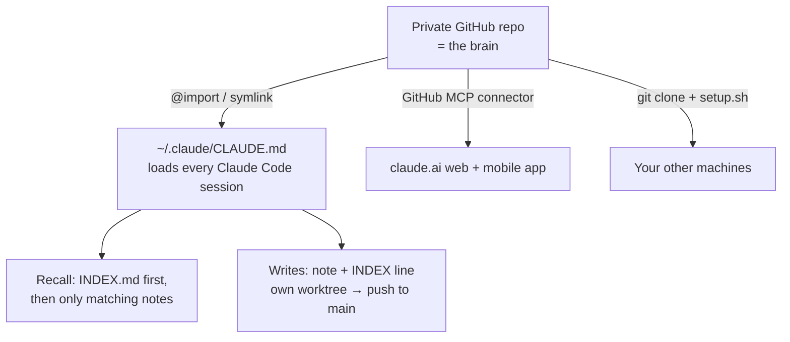

# How it works — and why it's just files

## The architecture, in one sentence

**The repo IS the brain**: markdown notes in a private git repo, a bootloader
(`CLAUDE.md`) that loads into every Claude Code session, and an index (`INDEX.md`)
that lets Claude find the right note without loading everything.



There are three moving parts, and you operate none of them:

1. **The files** — markdown notes, one fact per file, with YAML frontmatter and
   `[[wikilinks]]`. Durable, versioned, offline-capable, greppable, restorable.
2. **The wiring** — `~/.claude/CLAUDE.md` pulls the brain's bootloader into every
   session (user-scope memory is documented Claude Code behavior; the bootloader
   just happens to live in a repo).
3. **The protocols** — the bootloader tells Claude *how to remember*: recall =
   index-first and selective; writes = note + index line, committed in a throwaway
   worktree and pushed straight to `main`.

## Why not a memory database?

Every popular memory system for Claude adds infrastructure: a SQLite/vector store, an
embedding pipeline, a daemon, an MCP server, or a hosted service. Those solve recall
at scale — and cost you a dependency that can break, a service to operate, and a
store you can't read with your own eyes.

A personal brain doesn't have that scale problem. A year of dense, curated notes is a
few hundred kilobytes of markdown. Claude reads an index and opens three files faster
— and more transparently — than any retrieval pipeline. And because it's git:

- **History is free.** Every fact has a commit explaining when and why it changed.
- **Sync is free.** Push/pull replaces any sync service.
- **Durability is free.** GitHub is the backup; any clone is a full restore.
- **Portability is free.** It's markdown. It outlives any tool, including Claude.

If your brain ever grows a hundredfold, you can bolt retrieval on *top of the files*
then — the files stay the source of truth, so nothing is locked in.

## Why curation instead of auto-capture?

Auto-capture systems record everything and compress it later. That yields volume, not
memory: transcripts full of dead ends, wrong turns, and noise, with the load-bearing
facts buried. This system takes the opposite bet — **Claude writes memory the way a
person does: deciding, at the moment something matters, that it's worth keeping.**

The write protocol makes that cheap: one small note, one index line, one commit,
usually written mid-session while you're both looking at it. You curate by existing —
wrong notes get deleted, duplicates get merged, and the brain stays small enough that
all of it is *actually usable*.

## Why writes go through a worktree

The write protocol never edits the shared clone directly. Every write happens in a
throwaway git worktree and is pushed straight to remote `main` the moment it's made —
which is what `tools/brain-write.sh` automates:

```bash
wt=$(~/claude-brain/tools/brain-write.sh open)     # fresh worktree at origin/main
# ... Claude writes the note + index line inside $wt ...
~/claude-brain/tools/brain-write.sh publish "$wt" "brain: what was learned"
```

Two reasons, both earned the hard way:

- **Parallel sessions share one clone.** Two Claude sessions on the same machine both
  touching `INDEX.md` is a silent read-modify-write race — last save wins, the other
  write vanishes with no error. Worktrees give each write an isolated checkout, and
  remote `main` becomes the serialization point: a push is an atomic ref update, a
  lost push race is replayed with `pull --rebase`, and a genuine same-file collision
  surfaces as a visible conflict instead of silent loss.
- **"Push when practical" goes stale.** With more than one device, an unpushed memory
  is a memory your other machines don't have. Publishing pushes immediately —
  connector surfaces (which read GitHub live) see every write the moment it lands,
  and other clones catch up at their next pull. Offline, the write lands on the
  clone's local `main` (so it's still recallable on this device) — or a
  `pending-sync/*` branch if the clone is busy — and `tools/brain-write.sh sync`
  pushes it next time you're online.

Connector surfaces (claude.ai, the phone app, satellite devices) don't need any of
this: their writes are GitHub API commits, which are already atomic on the remote.

## The recall discipline

The bootloader teaches Claude a strict order:

1. Identity essentials — always loaded (they're tiny).
2. Need more? **Skim `INDEX.md`** — one line per note.
3. Open **only** the notes whose descriptions match the task.

This is the token-economy trick that makes a growing brain sustainable: sessions pay
for an index and a handful of relevant notes, never the whole corpus. Guard it by
keeping descriptions honest and notes single-purpose — see
[maintenance.md](maintenance.md).

## What goes in the brain (and what doesn't)

**In:** who you are, how you like to work, standing conventions, per-project mission
control (state/decisions/links), hard-won gotchas, pointers to where external things
live, journal entries for the sessions that mattered.

**Out:** anything a repo already records (code, file structure, git history), session
noise, and — absolutely — **secret values** ([security.md](security.md)).
